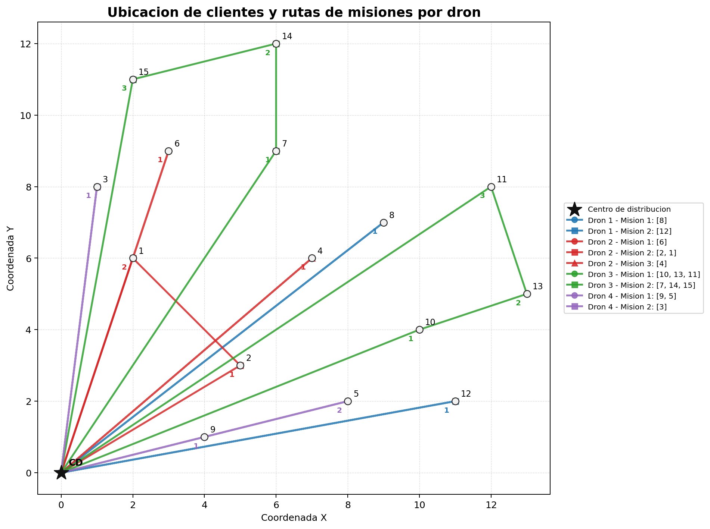
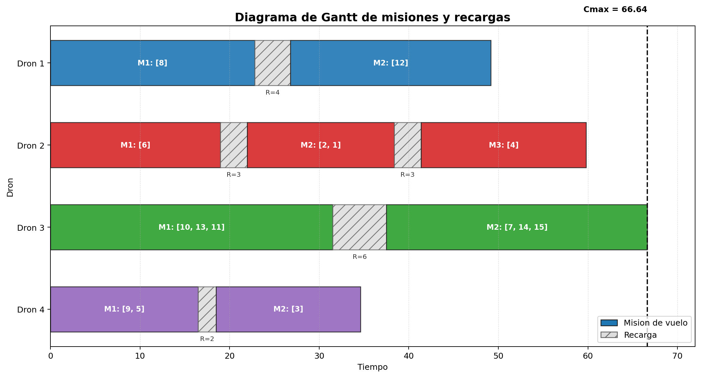
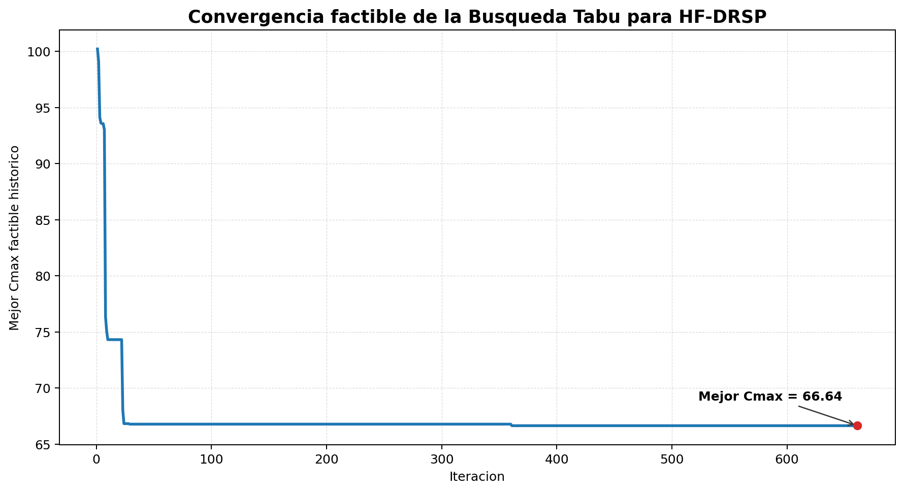

# HF-DRSP con Busqueda Tabu

Este proyecto presenta una solucion computacional para el problema de secuenciacion y ruteo de drones de entrega con flota heterogenea y tiempos de recarga, denominado `HF-DRSP` por sus siglas en ingles: Heterogeneous Fleet Drone Routing and Scheduling Problem.

El ejercicio se desarrolla con fines academicos como solucion de un taller de la asignatura Modelos de Optimizacion Avanzada, en el marco de la doble titulacion en Maestria en Ingenieria en Internet de las Cosas y Maestria en Inteligencia Artificial.

## 1. Descripcion del problema

Una empresa de logistica de ultima milla opera desde un centro de distribucion `CD`, ubicado para esta instancia en el punto `(0, 0)`, y debe entregar un conjunto de `N` pedidos a diferentes clientes de la ciudad. Para realizar las entregas dispone de una flota heterogenea de `M` drones.

Cada dron `k` pertenece a un tipo especifico y posee caracteristicas tecnologicas particulares:

- Capacidad de carga maxima `Q_k`: peso maximo que el dron puede transportar en un solo vuelo.
- Autonomia de vuelo `B_k`: distancia maxima, o tiempo maximo equivalente, que el dron puede recorrer antes de agotar su bateria.
- Tiempo de recarga `R_k`: tiempo que el dron debe permanecer en el `CD` conectado a la estacion de carga antes de estar disponible para una nueva mision.

Para la instancia desarrollada en el script se utiliza la siguiente flota:

| Dron | Capacidad maxima `Q_k` | Autonomia `B_k` | Tiempo de recarga `R_k` | Interpretacion operativa |
|---:|---:|---:|---:|---|
| 1 | 5.0 | 25.0 | 4.0 | Dron de capacidad media, adecuado para rutas individuales o agrupaciones moderadas. |
| 2 | 4.0 | 20.0 | 3.0 | Dron de menor recarga, util para ejecutar varias misiones cortas o medianas. |
| 3 | 7.0 | 32.0 | 6.0 | Dron de mayor capacidad y autonomia, apto para misiones largas y de mayor carga. |
| 4 | 3.5 | 17.0 | 2.0 | Dron pequeno, conveniente para pedidos cercanos o misiones de baja carga. |

Una mision corresponde al vuelo que realiza un dron desde el `CD`, entregando uno o varios pedidos, y regresando nuevamente al `CD`. En consecuencia, cada mision puede interpretarse como una ruta cerrada:

```text
CD -> Pedido i -> Pedido j -> ... -> CD
```

Para que una mision sea factible deben cumplirse las siguientes condiciones operativas:

- El peso total de los pedidos incluidos en la mision no puede exceder la capacidad `Q_k` del dron asignado.
- La distancia total recorrida en la mision no puede exceder la autonomia `B_k` del dron.
- Al finalizar una mision, el dron queda bloqueado durante un tiempo igual a `R_k` antes de poder iniciar la siguiente mision.
- Todos los pedidos deben ser entregados exactamente una vez.

El objetivo es determinar simultaneamente:

- La asignacion de pedidos a drones.
- La agrupacion de pedidos en misiones.
- El orden de visita de los clientes dentro de cada mision.
- La programacion o scheduling de las misiones para cada dron.

La funcion objetivo es minimizar el `makespan` `Cmax`, definido como el instante de tiempo en que el ultimo dron finaliza su ultima mision y retorna al `CD`.

## 2. Enfoque de solucion

El problema combina dos familias clasicas de optimizacion combinatoria:

- Ruteo de vehiculos con flota heterogenea, porque cada dron tiene capacidad, autonomia y caracteristicas operativas distintas.
- Secuenciacion en maquinas paralelas no identicas, porque cada dron actua como una maquina/recurso que procesa una secuencia de misiones y queda indisponible durante su recarga.

La dificultad no esta solamente en asignar pedidos a drones, sino en decidir simultaneamente como agrupar pedidos en misiones, en que orden visitarlos, que dron debe ejecutar cada mision y como la recarga afecta el tiempo total de finalizacion.

Para abordar este problema NP-duro se implementa una Busqueda Tabu con:

- Codificacion por listas: cada dron contiene una lista ordenada de misiones y cada mision contiene los pedidos visitados.
- Vecindario basado en movimientos `shift` e `swap`.
- Lista tabu con atributos `(ID_Pedido, ID_Dron)`.
- Tenor tabu dinamico aleatorio entre 7 y 15 iteraciones.
- Criterio de aspiracion global.
- Funcion objetivo penalizada para explorar temporalmente soluciones infactibles.

La funcion objetivo evaluada durante la busqueda es:

```text
F(S) = Cmax + alpha * exceso_capacidad + beta * exceso_bateria
```

## 3. Estructura del proyecto

```text
.
├── hf_drsp_tabu.py              # Script principal de optimizacion
├── plot_hf_drsp_solution.py     # Script para generar graficas
├── requirements.txt             # Dependencias del proyecto
├── result.txt                   # Salida de una ejecucion del algoritmo
├── figures/
│   ├── misiones_drones.png      # Mapa de rutas y misiones
│   └── gantt_misiones.png       # Diagrama de Gantt
└── README.md
```

## 4. Requisitos

- Python 3.9 o superior.
- `matplotlib` para generar las graficas de rutas y el diagrama de Gantt.

El script principal de optimizacion usa solo librerias estandar de Python. La dependencia externa se requiere unicamente para las visualizaciones.

## 5. Instalacion y preparacion del entorno

Crear el entorno virtual:

```bash
python3 -m venv .venv
```

En Windows, si `python3` no funciona, usar:

```bash
python -m venv .venv
```

Activar el entorno virtual en macOS o Linux:

```bash
source .venv/bin/activate
```

Activar el entorno virtual en Windows PowerShell:

```bash
.venv\Scripts\Activate.ps1
```

Activar el entorno virtual en Windows CMD:

```bash
.venv\Scripts\activate.bat
```

Instalar dependencias:

```bash
pip install -r requirements.txt
```

## 6. Ejecucion del algoritmo

Con el entorno virtual activo, ejecutar:

```bash
python hf_drsp_tabu.py
```

En algunos sistemas tambien puede usarse:

```bash
python3 hf_drsp_tabu.py
```

El script imprime en consola:

- La instancia del problema: drones, capacidades, autonomias, tiempos de recarga y pedidos.
- El resultado de la Busqueda Tabu.
- El makespan `Cmax`.
- La funcion objetivo penalizada.
- Excesos de capacidad y bateria.
- El plan de misiones por cada dron.

Salida resumida de referencia:

```text
=== Resultado Busqueda Tabu ===
Iteraciones ejecutadas: 661
Makespan Cmax: 66.64
Funcion objetivo penalizada: 66.64
Exceso total capacidad: 0.00
Exceso total bateria: 0.00
```

## 7. Generacion de graficas

Para generar las graficas de la solucion reportada en `result.txt`, ejecutar:

```bash
python plot_hf_drsp_solution.py
```

El script genera los siguientes archivos dentro de la carpeta `figures`:

```text
figures/misiones_drones.png
figures/gantt_misiones.png
figures/hf_drsp_convergencia.png
```

Si se desea recalcular la solucion mediante Busqueda Tabu antes de graficar, ejecutar:

```bash
python plot_hf_drsp_solution.py --resolve
```

### 7.1. Visualizacion de rutas y misiones

La siguiente figura representa espacialmente la solucion. El centro de distribucion aparece como `CD` en el origen `(0, 0)`, los clientes aparecen identificados por su numero de pedido y las lineas de color muestran las misiones asignadas a cada dron. Cada ruta inicia en el centro de distribucion, visita los clientes de la mision en el orden indicado y retorna al centro.



Esta grafica permite observar la logica geografica de la asignacion: los pedidos mas alejados o agrupados en zonas compatibles tienden a ser atendidos por drones con mayor autonomia, mientras que los drones con menor capacidad y bateria se concentran en misiones mas cortas. Tambien permite identificar visualmente rutas cercanas a los limites de autonomia, como ocurre con algunas misiones del Dron 4.

### 7.2. Diagrama de Gantt

La siguiente figura muestra la programacion temporal de las misiones. Las barras de color representan los periodos de vuelo de cada dron y las barras sombreadas representan los tiempos de recarga entre misiones consecutivas. La linea vertical punteada marca el `Cmax`, es decir, el instante en que finaliza la ultima mision del sistema.



El diagrama de Gantt permite interpretar el componente de scheduling del problema. Aunque los drones operan en paralelo, cada dron debe respetar su secuencia interna de misiones y los tiempos de recarga. En la solucion reportada, el Dron 3 define el makespan porque su segunda mision finaliza en `66.64`, mientras los demas drones terminan antes.

### 7.3. Curva de convergencia

La siguiente figura muestra la evolucion del mejor `Cmax` historico durante la Busqueda Tabu. Esta grafica permite observar en que etapas el algoritmo encuentra mejoras y cuando entra en una fase de estabilizacion sin mejoras relevantes.



Desde la perspectiva de optimizacion, una disminucion escalonada de la curva indica que los movimientos del vecindario lograron encontrar soluciones con menor makespan. Cuando la curva se vuelve horizontal, la busqueda continua explorando, pero no encuentra una solucion historicamente mejor durante ese tramo.

## 8. Analisis del resultado obtenido

El archivo `result.txt` contiene la salida de una ejecucion del algoritmo de Busqueda Tabu aplicado a la instancia de prueba. La ejecucion reportada finalizo despues de 661 iteraciones.

### 8.1. Resumen numerico

```text
Makespan Cmax: 66.64
Funcion objetivo penalizada: 66.64
Exceso total capacidad: 0.00
Exceso total bateria: 0.00
Alpha final: 5.00 | Beta final: 2.00
```

El hecho de que la funcion objetivo penalizada sea igual al makespan indica que la solucion final no presenta violaciones de restricciones. En terminos de la funcion:

```text
F(S) = Cmax + alpha * exceso_capacidad + beta * exceso_bateria
```

se tiene:

```text
F(S) = 66.64 + alpha * 0.00 + beta * 0.00 = 66.64
```

Por tanto, la solucion encontrada es factible respecto a las restricciones fisicas y operativas del sistema: capacidad de carga, autonomia de bateria y secuenciacion de recargas entre misiones.

### 8.2. Interpretacion de la solucion

La asignacion final de pedidos fue:

```text
Dron 1: [8], [12]
Dron 2: [6], [2, 1], [4]
Dron 3: [10, 13, 11], [7, 14, 15]
Dron 4: [9, 5], [3]
```

Los corchetes representan misiones. Por ejemplo, `[2, 1]` significa que el dron sale del `CD`, atiende primero el Pedido 2, luego el Pedido 1, y retorna al `CD`. El orden dentro de la lista es relevante porque define la secuencia de visita.

La solucion cubre los pedidos del 1 al 15 exactamente una vez, por lo que cumple la restriccion de cobertura total de la demanda. La distribucion tambien muestra que el algoritmo no realiza una asignacion uniforme en cantidad de pedidos, sino una asignacion condicionada por la heterogeneidad de la flota.

La tabla resume las caracteristicas de cada mision de la solucion reportada:

| Dron | Mision | Pedidos | Inicio | Fin | Distancia | Carga | Recarga posterior | Estado |
|---:|---:|---|---:|---:|---:|---:|---:|---|
| 1 | 1 | `[8]` | 0.00 | 22.80 | 22.80 | 1.80 | 4.00 | Factible |
| 1 | 2 | `[12]` | 26.80 | 49.16 | 22.36 | 2.40 | - | Factible |
| 2 | 1 | `[6]` | 0.00 | 18.97 | 18.97 | 1.50 | 3.00 | Factible |
| 2 | 2 | `[2, 1]` | 21.97 | 38.37 | 16.40 | 3.40 | 3.00 | Factible |
| 2 | 3 | `[4]` | 41.37 | 59.81 | 18.44 | 2.80 | - | Factible |
| 3 | 1 | `[10, 13, 11]` | 0.00 | 31.52 | 31.52 | 6.20 | 6.00 | Factible |
| 3 | 2 | `[7, 14, 15]` | 37.52 | 66.64 | 29.12 | 5.40 | - | Factible |
| 4 | 1 | `[9, 5]` | 0.00 | 16.49 | 16.49 | 3.30 | 2.00 | Factible |
| 4 | 2 | `[3]` | 18.49 | 34.62 | 16.12 | 1.20 | - | Factible |

La columna `Recarga posterior` aplica solamente cuando el mismo dron tiene una mision siguiente. En la ultima mision de cada dron no se suma recarga al `Cmax`, porque el objetivo considera el retorno final al centro de distribucion.

### 8.3. Analisis por dron

#### Dron 1

```text
Mision 1: [8]  | fin = 22.80 | carga = 1.80 | distancia = 22.80
Mision 2: [12] | fin = 49.16 | carga = 2.40 | distancia = 22.36
```

El Dron 1 atiende pedidos individuales ubicados relativamente lejos del centro de distribucion. Aunque su capacidad es `5.0`, la autonomia `25.0` restringe la posibilidad de agrupar estos pedidos con otros clientes sin comprometer la factibilidad de bateria.

#### Dron 2

```text
Mision 1: [6]    | fin = 18.97 | carga = 1.50 | distancia = 18.97
Mision 2: [2, 1] | fin = 38.37 | carga = 3.40 | distancia = 16.40
Mision 3: [4]    | fin = 59.81 | carga = 2.80 | distancia = 18.44
```

El Dron 2 ejecuta tres misiones. A pesar de tener una capacidad y autonomia intermedias, su tiempo de recarga es bajo (`R = 3.0`), lo que le permite procesar mas misiones sin convertirse en el recurso critico.

#### Dron 3

```text
Mision 1: [10, 13, 11] | fin = 31.52 | carga = 6.20 | distancia = 31.52
Recarga: 6.00
Mision 2: [7, 14, 15]  | fin = 66.64 | carga = 5.40 | distancia = 29.12
```

El Dron 3 es el dron de mayor capacidad (`Q = 7.0`) y mayor autonomia (`B = 32.0`). Por esta razon, el algoritmo le asigna las misiones mas exigentes en distancia y carga. Sin embargo, tambien tiene el mayor tiempo de recarga (`R = 6.0`), lo que incrementa su tiempo acumulado.

Este dron define el makespan de la solucion:

```text
Cmax = 66.64
```

Por tanto, el Dron 3 es el cuello de botella del sistema. En terminos de optimizacion, cualquier mejora relevante sobre la solucion actual deberia intentar reducir el tiempo total de este dron, ya sea reasignando algun pedido de su segunda mision o encontrando una ruta equivalente con menor distancia.

#### Dron 4

```text
Mision 1: [9, 5] | fin = 16.49 | carga = 3.30 | distancia = 16.49
Mision 2: [3]    | fin = 34.62 | carga = 1.20 | distancia = 16.12
```

El Dron 4 tiene la menor capacidad (`Q = 3.5`) y la menor autonomia (`B = 17.0`). La solucion lo usa para misiones cortas y de baja carga. La primera mision queda muy cerca de sus limites: carga `3.30` sobre `3.50` y distancia `16.49` sobre `17.00`.

### 8.4. Factibilidad

La solucion final es factible por tres razones:

- Cobertura: los 15 pedidos son atendidos exactamente una vez.
- Capacidad: ninguna mision supera la capacidad maxima del dron asignado.
- Autonomia: ninguna ruta supera la autonomia disponible del dron.

Adicionalmente, la secuenciacion respeta los tiempos de recarga. Por ejemplo, el Dron 3 finaliza su primera mision en `31.52`, permanece en recarga durante `6.00` unidades de tiempo e inicia su segunda mision en `37.52`.

Desde una perspectiva de sistemas IoT, la restriccion de recarga puede interpretarse como un periodo de indisponibilidad fisica del dispositivo. En una implementacion real, este dato podria provenir de telemetria de bateria, estaciones de carga inteligentes o modelos predictivos de degradacion energetica.

### 8.5. Lectura desde inteligencia artificial

Desde la Maestria en Inteligencia Artificial, la Busqueda Tabu puede analizarse como una tecnica de busqueda local inteligente con memoria adaptativa. Aunque no aprende un modelo estadistico, incorpora mecanismos propios de IA simbolica y metaheuristica:

- Memoria de corto plazo para evitar ciclos.
- Criterio de aspiracion para aceptar movimientos tabu si producen una mejora global.
- Exploracion de vecindarios mediante operadores de transformacion.
- Penalizacion adaptativa para balancear factibilidad y calidad de solucion.

El algoritmo representa una alternativa razonable cuando no se busca una prueba exacta de optimalidad, sino una solucion factible de buena calidad en un tiempo computacional controlado.

## 9. Modificacion de la instancia

Los datos de prueba se encuentran dentro de la funcion `demo_instance()` en `hf_drsp_tabu.py`.

Alli se pueden modificar:

- Coordenadas de los pedidos.
- Peso o demanda de cada pedido.
- Numero de drones.
- Capacidad maxima `capacity`.
- Autonomia `battery`.
- Tiempo de recarga `recharge`.

Si se modifica la instancia y se desea que las graficas reflejen la nueva solucion, se recomienda ejecutar:

```bash
python plot_hf_drsp_solution.py --resolve
```

## 10. Conclusiones

La solucion obtenida es consistente con el planteamiento academico del HF-DRSP, ya que integra decisiones de ruteo, asignacion y secuenciacion bajo restricciones de capacidad, autonomia y recarga. El valor `Cmax = 66.64` representa el tiempo necesario para completar todas las entregas, considerando que los drones pueden operar en paralelo pero cada uno debe respetar su propia secuencia de misiones.

El resultado demuestra que la flota heterogenea se utiliza de manera diferenciada: los drones con mayor autonomia absorben rutas mas exigentes, mientras que los drones pequenos son asignados a misiones cercanas o de baja carga. Esta asignacion es coherente con el comportamiento esperado de un sistema logistico basado en drones.

El cuello de botella se encuentra en el Dron 3. Aunque es el recurso mas capaz, su combinacion de misiones largas y recarga elevada determina el tiempo final del sistema. Por tanto, una mejora futura deberia concentrarse en reducir el tiempo acumulado de ese dron sin trasladar infactibilidad a los demas recursos.

Finalmente, el uso de Busqueda Tabu es adecuado para el contexto del taller porque permite abordar un problema NP-duro mediante una tecnica metaheuristica interpretable, parametrizable y extensible. Para trabajos posteriores se podrian comparar los resultados contra otras estrategias como Algoritmos Geneticos, Recocido Simulado, GRASP o modelos MILP para instancias pequenas, con el fin de evaluar calidad de solucion, estabilidad y tiempo computacional.

## 11. Cierre del entorno virtual

Cuando se termine de trabajar:

```bash
deactivate
```
