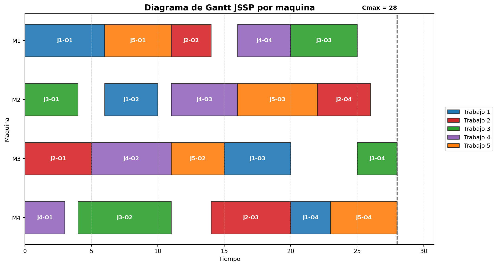
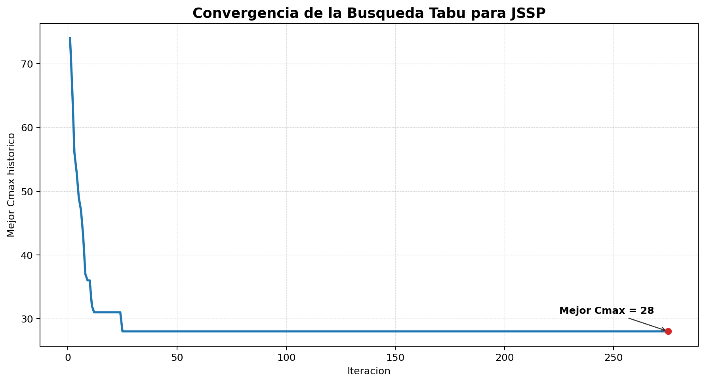

# JSSP con Busqueda Tabu

Este documento presenta la solucion computacional del segundo enunciado: Job Shop Scheduling Problem (`JSSP`) resuelto mediante Busqueda Tabu.

El ejercicio se desarrolla con fines academicos para la asignatura Modelos de Optimizacion Avanzada, en el marco de la doble titulacion en Maestria en Ingenieria en Internet de las Cosas y Maestria en Inteligencia Artificial.

## 1. Enunciado del problema

Un taller de manufactura avanzado requiere procesar un conjunto de `n` trabajos distintos utilizando un conjunto de `m` maquinas diferentes. A diferencia de un sistema en linea o Flow-Shop, cada trabajo posee su propia ruta tecnologica o secuencia unica de operaciones.

Por ejemplo:

```text
Trabajo 1: M1 -> M2 -> M3
Trabajo 2: M3 -> M1 -> M2
```

Cada operacion tiene:

- Un trabajo al que pertenece.
- Una posicion dentro de la secuencia tecnologica del trabajo.
- Una maquina especifica requerida.
- Un tiempo de procesamiento determinista.

Las restricciones operativas son:

- Cada maquina solo puede procesar una operacion a la vez.
- Las operaciones de un mismo trabajo deben respetar su orden tecnologico.
- Una vez que una operacion inicia, no puede ser interrumpida. Esto corresponde a la restriccion de no preemption.
- Todas las operaciones de todos los trabajos deben ser programadas.

El objetivo es encontrar la secuencia de procesamiento de operaciones en cada maquina que minimice el `makespan` `Cmax`, definido como el tiempo total transcurrido desde el inicio de la primera operacion hasta la finalizacion de la ultima operacion del ultimo trabajo.

## 2. Instancia utilizada

La instancia academica implementada en `jssp_tabu.py` contiene 5 trabajos y 4 maquinas.

| Trabajo | Ruta tecnologica |
|---:|---|
| 1 | `M1(p=6) -> M2(p=4) -> M3(p=5) -> M4(p=3)` |
| 2 | `M3(p=5) -> M1(p=3) -> M4(p=6) -> M2(p=4)` |
| 3 | `M2(p=4) -> M4(p=7) -> M1(p=5) -> M3(p=3)` |
| 4 | `M4(p=3) -> M3(p=6) -> M2(p=5) -> M1(p=4)` |
| 5 | `M1(p=5) -> M3(p=4) -> M2(p=6) -> M4(p=5)` |

La notacion `M1(p=6)` indica que la operacion requiere la maquina 1 y tiene tiempo de procesamiento igual a 6 unidades.

## 3. Enfoque de solucion

El `JSSP` es un problema clasico NP-duro de optimizacion combinatoria. En este proyecto se resuelve con Busqueda Tabu, una metaheuristica de busqueda local con memoria.

La solucion se codifica como una secuencia de prioridad por maquina:

```text
Maquina 1: [1, 5, 2, 4, 3]
```

Esto significa que, en la maquina 1, las operaciones disponibles se procesan siguiendo esa prioridad de trabajos, siempre que tambien se respeten las precedencias internas de cada trabajo.

El algoritmo implementa:

- Solucion inicial por orden natural de trabajos.
- Decodificacion de prioridades en un calendario factible.
- Funcion objetivo basada en `Cmax`.
- Vecindario por intercambio de prioridades en una maquina.
- Lista tabu para evitar reversas inmediatas.
- Criterio de aspiracion si un movimiento tabu mejora el mejor `Cmax` historico.
- Criterio de parada por maximo de iteraciones o por iteraciones sin mejora.

## 4. Estructura relacionada

```text
.
├── jssp_tabu.py        # Script principal para resolver JSSP
├── plot_jssp_solution.py # Script para generar graficas del JSSP
├── result2.txt         # Salida de una ejecucion del script JSSP
├── figures/
│   ├── jssp_gantt_maquinas.png
│   └── jssp_convergencia.png
└── README_JSSP.md      # Documentacion del segundo enunciado
```

## 5. Requisitos

- Python 3.9 o superior.
- `matplotlib` para generar las graficas.

El script `jssp_tabu.py` usa solamente librerias estandar de Python. La dependencia `matplotlib` se requiere unicamente para `plot_jssp_solution.py`.

## 6. Ejecucion

Desde la carpeta del proyecto, ejecutar:

```bash
python jssp_tabu.py
```

En algunos sistemas tambien puede usarse:

```bash
python3 jssp_tabu.py
```

El script imprime:

- Rutas tecnologicas de cada trabajo.
- Resultado de la Busqueda Tabu.
- Secuencia de prioridad por maquina.
- Calendario por maquina.
- Calendario por trabajo.
- Makespan `Cmax`.

## 7. Generacion de graficas

Para generar las graficas del calendario JSSP, ejecutar:

```bash
python plot_jssp_solution.py
```

El script genera:

```text
figures/jssp_gantt_maquinas.png
figures/jssp_convergencia.png
```

### 7.1. Diagrama de Gantt por maquina

El siguiente diagrama muestra la programacion temporal de las operaciones en cada maquina. Cada color representa un trabajo diferente, y cada barra identifica la operacion procesada en una maquina especifica. La linea vertical punteada marca el `Cmax = 28`.



Esta grafica permite verificar visualmente que ninguna maquina procesa dos operaciones simultaneamente y que existen periodos de espera asociados a las restricciones de precedencia entre operaciones de un mismo trabajo.

### 7.2. Curva de convergencia

La siguiente grafica muestra la evolucion del mejor `Cmax` historico durante la Busqueda Tabu.



La curva permite observar el comportamiento de mejora del algoritmo. Cuando la curva se estabiliza, indica que la busqueda no ha encontrado una secuencia con menor `Cmax` durante las iteraciones recientes.

## 8. Resultado obtenido

El archivo `result2.txt` contiene una ejecucion del script con el siguiente resultado resumido:

```text
=== Resultado Busqueda Tabu JSSP ===
Iteraciones ejecutadas: 275
Makespan Cmax: 28
```

La solucion encontrada tiene las siguientes prioridades por maquina:

| Maquina | Secuencia de prioridad |
|---:|---|
| 1 | `[1, 5, 2, 4, 3]` |
| 2 | `[3, 1, 4, 5, 2]` |
| 3 | `[2, 4, 5, 1, 3]` |
| 4 | `[4, 3, 2, 1, 5]` |

## 9. Calendario por maquina

| Maquina | Trabajo | Operacion | Inicio | Fin | Procesamiento |
|---:|---:|---:|---:|---:|---:|
| 1 | 1 | 1 | 0 | 6 | 6 |
| 1 | 5 | 1 | 6 | 11 | 5 |
| 1 | 2 | 2 | 11 | 14 | 3 |
| 1 | 4 | 4 | 16 | 20 | 4 |
| 1 | 3 | 3 | 20 | 25 | 5 |
| 2 | 3 | 1 | 0 | 4 | 4 |
| 2 | 1 | 2 | 6 | 10 | 4 |
| 2 | 4 | 3 | 11 | 16 | 5 |
| 2 | 5 | 3 | 16 | 22 | 6 |
| 2 | 2 | 4 | 22 | 26 | 4 |
| 3 | 2 | 1 | 0 | 5 | 5 |
| 3 | 4 | 2 | 5 | 11 | 6 |
| 3 | 5 | 2 | 11 | 15 | 4 |
| 3 | 1 | 3 | 15 | 20 | 5 |
| 3 | 3 | 4 | 25 | 28 | 3 |
| 4 | 4 | 1 | 0 | 3 | 3 |
| 4 | 3 | 2 | 4 | 11 | 7 |
| 4 | 2 | 3 | 14 | 20 | 6 |
| 4 | 1 | 4 | 20 | 23 | 3 |
| 4 | 5 | 4 | 23 | 28 | 5 |

## 10. Analisis del resultado

El valor `Cmax = 28` indica que todas las operaciones de todos los trabajos finalizan al tiempo 28. Este valor corresponde al instante de finalizacion mas tardio observado en el calendario.

Los trabajos que terminan en el tiempo 28 son:

- Trabajo 3: finaliza en `M3[25,28]`.
- Trabajo 5: finaliza en `M4[23,28]`.

Esto indica que el tramo final del calendario esta determinado por la coordinacion entre las maquinas 3 y 4. El resultado es factible porque:

- Ninguna maquina procesa dos operaciones al mismo tiempo.
- Cada trabajo respeta su ruta tecnologica.
- No hay interrupciones en las operaciones.
- Todas las operaciones fueron programadas.

Desde el punto de vista de optimizacion avanzada, la Busqueda Tabu permite explorar secuencias alternativas de procesamiento evitando ciclos mediante memoria de corto plazo. El criterio de aspiracion permite aceptar un movimiento tabu si mejora el mejor `Cmax` historico, lo cual ayuda a escapar de optimos locales.

## 11. Conclusiones

La solucion obtenida muestra una programacion factible para el `JSSP` con `Cmax = 28`. El algoritmo logra coordinar rutas tecnologicas diferentes para cinco trabajos sobre cuatro maquinas, respetando precedencias, capacidad unitaria de maquina y no interrupcion.

El uso de Busqueda Tabu es adecuado para este problema porque el espacio de secuencias posibles crece rapidamente con el numero de trabajos y maquinas. Para trabajos futuros se podria comparar esta solucion con modelos exactos MILP en instancias pequenas o con otras metaheuristicas como Recocido Simulado, GRASP o Algoritmos Geneticos.
